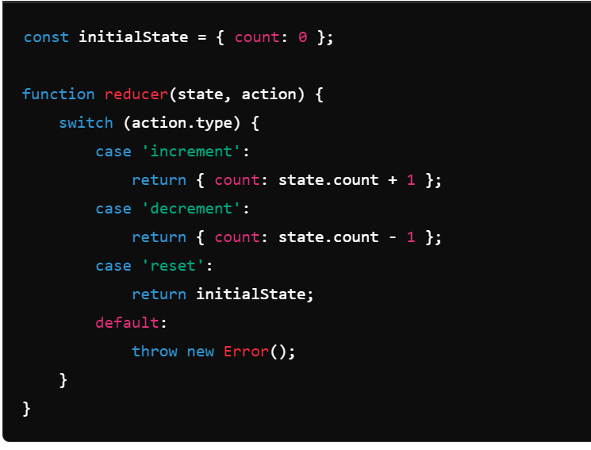
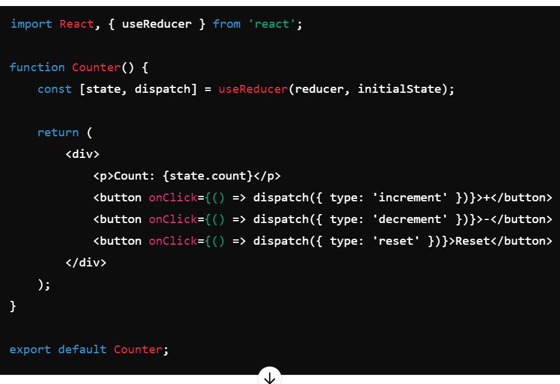
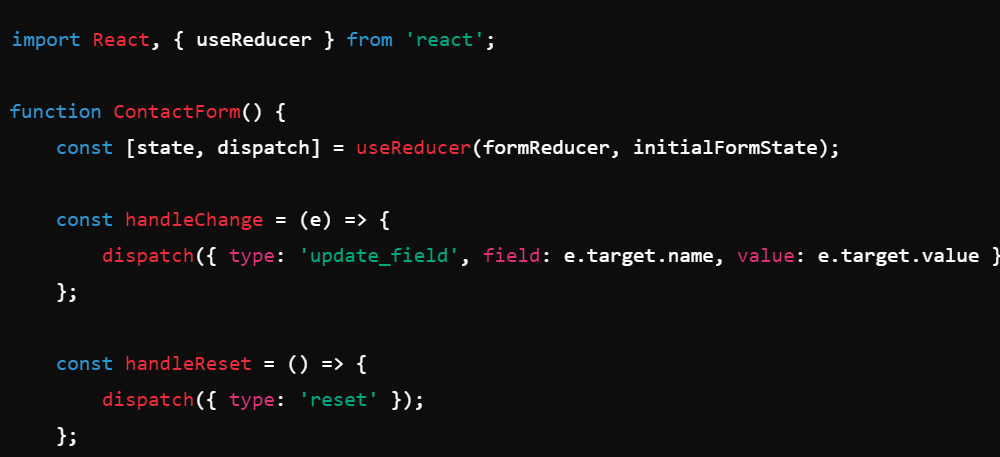
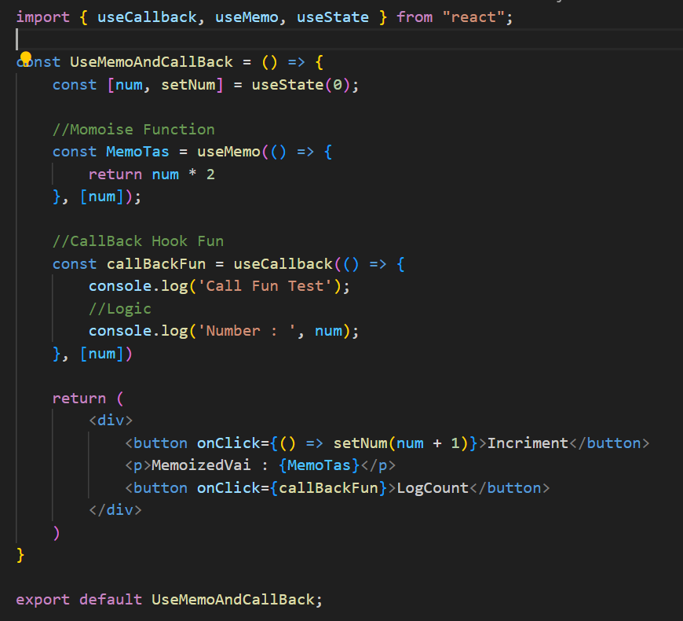
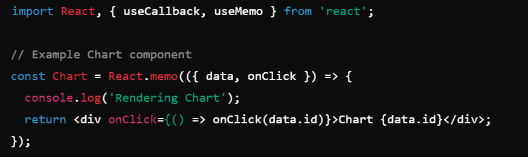

> useState
01. Task create btn remove and clr then utilze function use data.js map it.
- useStateArrTask.jsx
02. Task useState use object val and show on Ui
- usestae

> useEffect
- for handle side effect
01. Task useeffect fetch api of git and show data on ui.
- useEffect.js 
- using useEffect clean up function -  return () => {
      clearInterval(intervalId);
      console.log('Interval cleared');
    };
- Cleanup functions are useful for cleaning up subscriptions, timers, or any other side effects that need to be cleaned up to avoid memory leaks or unexpected behavior.
02. Task fetApi use loding, err, data 
- useEffectMultiple.jsx

> useReff
- mostily use in form handling for avoiding re-rendring pages
- the DOM directly and maintain mutable values without causing re-renders
01. Ctrat usereff.jsx and two feature need to be add input and button and log input val & focus() after click on input
- usereff.jsx
02. Task creat form input,btn and all input need to be store in [] and and render on ui
- formreff.jsx

> Custom Hook
- need to be start by use like as useFetch.
- reuse logic across multiple components. 
- Common Use Cases for Custom Hooks : feaching data, form handling, Authentication, Local Storage, Media Query Etc
01. Task Fetching API
- 

> contextApi
- useContext is a hook in React that allows you to access and use context values in your functional components.Context provides a way to share values like themes, user information, or settings between components without having to pass props down manually at every level.
- It is particularly useful for scenarios where multiple components need access to the same state or functions, such as theming, user authentication, and global settings. 
- Avoids Prop Drilling: Passes data through the component tree without needing to pass props at every level.
- Simplicity: No need to install additional libraries like Redux.
- Creating a Context: createContext is used to create a new context.
- Providing a Context Value: ThemeContext.Provider is used to wrap components and provide the context value ("dark" in this case).
- Consuming the Context Value: useContext(ThemeContext) is used to access the current value of the context inside the ThemeButton component. It gives you the value provided by the nearest ThemeContext.Provider above in the component tree.

01. Step-by-Step Implementation
 - Create a Context for Authentication:
 import React, { createContext, useState, useContext } from 'react';
 // Create the context
export const AuthContext = createContext();
- 

 - Wrap Your Application with the AuthProvider.provider value= {{}}

 - Use the Context in Your Components:
 

02. creat Task
- created NavBar.jsx
- NabBarLinks.jsx
- UserContainer.jsx


> useReduser Hook
- you have multiple state variables that need to be managed together.
- It centralizes state management, making the code easier to read and maintain. 
> Steps - 
1. Initial State and Reducer Function:

2. Component Setup:

3. Dispatching Actions:


- cost [state, dispatch] = useReduser(reduserFn, defaultState)
Here defaultState -------------- is connected by state we can acess by state.defaultState value
- dispatch is consult from reduserFn 
- In reduserFn(state, action)=>{} and any thing need to be change (dispatch) then must be provide dispatch({type : })
 -  const clearList = () => {
    dispatch({ type: CLEAR_LIST });
  }; 
  only need to be pass convension list

  > # Diffrance Between UseMemo and CallbackHook
  - useMemo is used to memoize a value, i.e., it returns a memoized value. It recalculates the value only when one of its dependencies changes.
  - useCallback is used to memoize a callback function. It returns a memoized version of the callback function that only changes if one of its dependencies has changed.
  
  - Skipping re-rendering of components
  - If you forget the dependency array, useCallback will return a new function every time:

  > #  React.memo
  - React.memo is a powerful tool for optimizing the performance of functional components by preventing unnecessary re-renders. It is particularly useful in scenarios where:
  - React.memo: Wraps the Chart component to prevent re-rendering if the props do not change.
  

1. Components receive static props that do not change often. 
2. Components are part of a list or collection.
3. Components involve expensive calculations or complex rendering.
4. Parent components re-render frequently due to state changes.
5. Pure function
```
// use all three hook memo, usememo, useCallback
import { useCallback, useState } from 'react';
import Items from './Items';

//Use usecall back, react.memo
const Uishow = () => {
  const [items, setItems] = useState([
    { id: 1, name: 'Item 1', count: 0 },
    { id: 2, name: 'Item 2', count: 0 },
    { id: 3, name: 'Item 3', count: 0 },
  ]);

  const incriment = useCallback((id) => {
    console.log('click');
    setItems((prev) =>
      prev.map((data) =>
        data.id === id ? { ...data, count: data.count + 1 } : data
      )
    );
  }, []);
  return (
    <div>
      <h2>Advace React with Hook</h2>
      {items.map((data) => (
        <Items key={data.id} data={data} incriment={incriment} />
      ))}
    </div>
  );
};
export default Uishow;

::::::::::::::Items.jsx
import { memo, useMemo } from 'react';

const Items = memo(({ data, incriment }) => {
  console.log('memo concept');
  const { id, count, name } = data;

  const memoTask = useMemo(() => {
    console.log('memotaskkkk');
    return count;
  }, [count]);
  return (
    <div>
      <h4>Items Counts...</h4>
      <p>
        {name}: {memoTask}
      </p>
      <button onClick={() => incriment(id)}>➕</button>
    </div>
  );
});
export default Items;
```