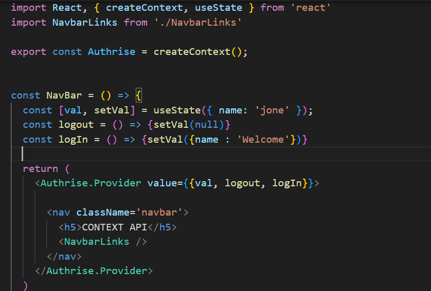
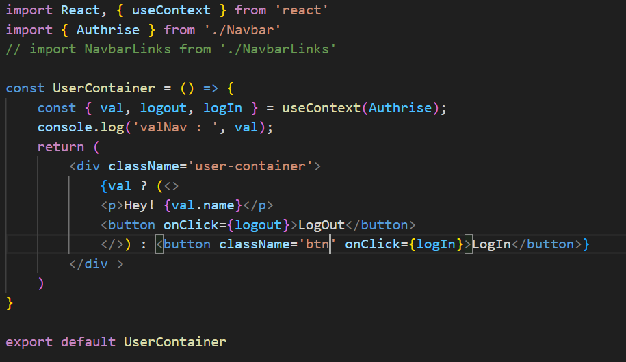

> useState
01. Task create btn remove and clr then utilze function use data.js map it.
- useStateArrTask.jsx
02. Task useState use object val and show on Ui
- usestae

> useEffect
- for handle side effect
01. Task useeffect fetch api of git and show data on ui.
- useEffect.js 
- using useEffect clean up function -  return () => {
      clearInterval(intervalId);
      console.log('Interval cleared');
    };
- Cleanup functions are useful for cleaning up subscriptions, timers, or any other side effects that need to be cleaned up to avoid memory leaks or unexpected behavior.
02. Task fetApi use loding, err, data 
- useEffectMultiple.jsx

> useReff
- mostily use in form handling for avoiding re-rendring pages
- the DOM directly and maintain mutable values without causing re-renders
01. Ctrat usereff.jsx and two feature need to be add input and button and log input val & focus() after click on input
- usereff.jsx
02. Task creat form input,btn and all input need to be store in [] and and render on ui
- formreff.jsx

> Custom Hook
- need to be start by use like as useFetch.
- reuse logic across multiple components. 
- Common Use Cases for Custom Hooks : feaching data, form handling, Authentication, Local Storage, Media Query Etc
01. Task Fetching API
- 

> contextApi
- It is particularly useful for scenarios where multiple components need access to the same state or functions, such as theming, user authentication, and global settings. 
- Avoids Prop Drilling: Passes data through the component tree without needing to pass props at every level.
- Simplicity: No need to install additional libraries like Redux.
01. Step-by-Step Implementation
 - Create a Context for Authentication:
 import React, { createContext, useState, useContext } from 'react';
 // Create the context
export const AuthContext = createContext();
- 

 - Wrap Your Application with the AuthProvider.provider value= {{}}

 - Use the Context in Your Components:
 

02. creat Task
- created NavBar.jsx
- NabBarLinks.jsx
- UserContainer.jsx

