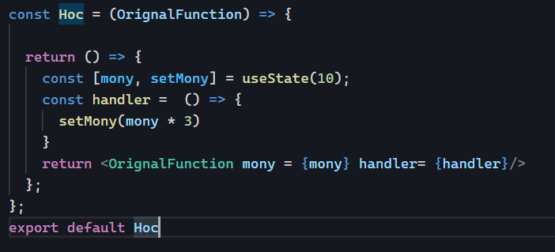
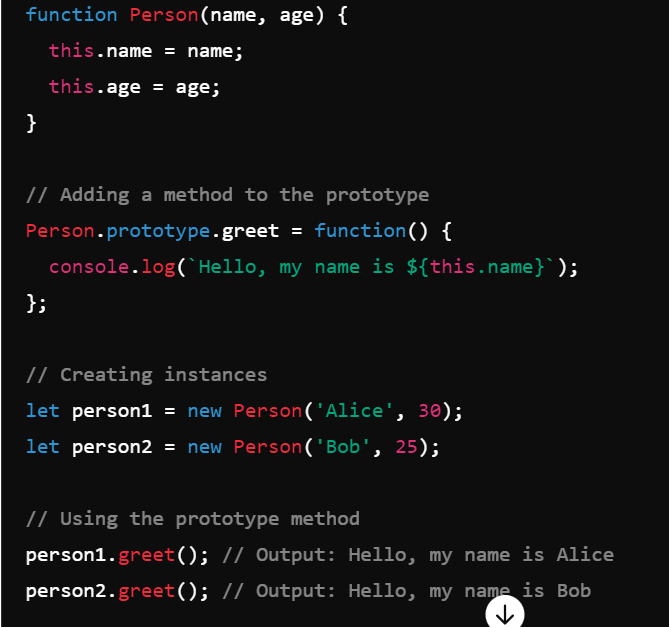
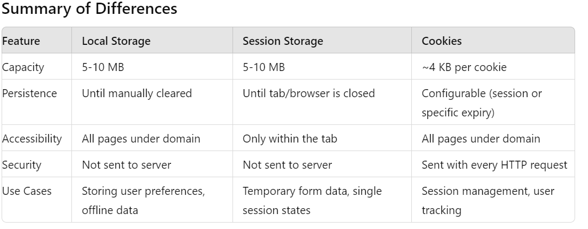

repo - https://github.com/john-smilga/react-course-v3
> Fetch focha
- it doesnot conside 404 as a error.

> # API REFf - https://www.course-api.com/

<!-- -----------------Inter vIew question--------------------- -->
# Q - What is symantic tag in html?
 Ans -  These tags provide better accessibility, improved SEO, and more meaningful markup. Tags are define in two ways.
 > Symantic
 - semantic tags help define the structure of the webpage, making it more understandable for both humans and machines.
 - Eaxample :- 
 1. header: Represents a container for introductory content or a set of navigational links.
02. nav>: efines a set of navigation links.
03. sectio>: Represents a thematic grouping of content, typically with a heading.
04. articl>: Represents a self-contained piece of content, like a blog post or news article.
05. aside> Defines content that is tangentially related to the content around it, often used for sidebars.
06. footer: Represents a footer for a section or the entire document, often containing metadata or links.
07. main>:Specifies the main content of a document, excluding headers, footers, and sidebars.
08. figure: Represents self-contained content, like illustrations, diagrams, photos, or code listings, often with a caption.
09. figcapion>: Provides a caption for the figure element.
10. time>:Represents a specific period in time.

> Non-Symantic
- Non-semantic tags in HTML are elements that do not provide any information about the content contained 
- They are often used in conjunction with CSS and JavaScript to control the presentation and behavior of web content.
- Example - 
01. div>: A generic container used to group together HTML elements.
02. span>: A generic inline container used to group together text or inline elements.

# Q - What is HOC component with example expain.
- A Higher-Order Component (HOC) in React is an advanced technique for reusing component logic.
- HOCs are functions that take a component as a argument and return a new component.
- HOCs are Functions: They take a component as an argument and return a new component.


```
Task - 01
//Show two Array Filter by search
Hoc.jsx
import React, { useRef, useState } from 'react'

const Hoc = (Orignal) => {

    return () => {
        const list1 = ['Eggfruit', 'Fig', 'Grape', 'Honeydew', 'Apple'];
        const list2 = ['Apple', 'Banana', 'Cherry', 'Date'];
        const [serch, setSearc] =  useState('')
        const inputReff =  useRef();

        const filterSearch = (list1, search)=> {
            return list1.filter(data=> data.toLowerCase().includes(serch.toLowerCase()))
        }
        const filter1 = filterSearch(list1, serch)
        const filter2 = filterSearch(list2, serch)
        return (
        <div className="">
            <input type="text" ref={inputReff} value={serch} onChange={()=> setSearc(inputReff.current.value)} placeholder='search me'/>
            <Orignal list1 = {filter1} list2 = {filter2}/>
        </div>
        )
    }
}

export default Hoc

:::Uishow.jsx:::
import React from 'react'
import Hoc from './Hoc'

const UiList = ({list1, list2}) => {
  return (
    <div>
      <h2>HOC Concept</h2>
      <ul>
        <p>List one</p>
        {list1.map(data=> <li>{data}</li>)}
      </ul>
      <ul>
        <p>List Two</p>
        {list2.map(data=> <li>{data}</li>)}
      </ul>
    </div>
  )
}

export default Hoc(UiList)


```

# Q - Diffrence between context api and redux.
Both the Context API and Redux are tools for managing state in React applications.

> Context Api
- 'Simple State Management:' Does not include complex state management features like middleware, side effects handling, or advanced debugging tools.
- Avoid Props drilling.
- Prop Drilling Solution: Helps to avoid prop drilling by providing a way to pass data deeply through the component tree without having to pass props manually at every level.
- Basic State Management: Does not include complex state management features like middleware, side effects handling, or advanced debugging tools.


> Redux
- Complex State Management 
- Global State Management: Suitable for managing global state across various parts of the application, even when the components are not directly related.
- Single Source of Truth: State is stored in a single object, known as the store.
- Middleware Support: Includes middleware for handling side effects (e.g., redux-thunk, redux-saga).
- DevTools Integration: Powerful debugging tools such as Redux DevTools for inspecting state changes.
- Time Travel Debugging: Ability to go back and forth in state changes for easier debugging.
RTK /ReduxLates

#  Q create a react app with Start,Stop and Reset button and when we click timer will start/stop/pause/reset

```
const arr = [1, 4, 5, 6, 2, 3, 4, 5];

const duplicatFind = (arr) => {
  let duplicat = [];
  let unique = [];
  let nestedDuplicat = [];

  for (let key of arr) {
    if (key % 2 === 0) {
      duplicat.push(key);
      if (unique.includes(key)) {
        console.log(unique.includes(key));
        nestedDuplicat.push(key);
      } else {
        console.log(unique.includes(key));
        unique.push(key);
      }
    }
  }

  return { duplicat, unique, nestedDuplicat };
};
const result = duplicatFind(arr);
console.log(result);

```
# Q- const Arr = [1, [4, [5, 6]], [2, [3, [4, 5]]]]; 
01. convert in [x,x,x,x,x]
02. Asc
03. remove duplicate
- by new Set(Arr) will give unique value of object
- const uniQueDat =  new Set(Assanding); //object
const convertArr = [...uniQueDat]
console.log('uniQueDat: ', convertArr)
04. find even and odd
05. total
```
const arr = [1, [4, [5, 6]], [2, [3, [4, 5]]]];

const isArrCheck = (valArr) => {
  let result = [];
  let total = 0;
  let even;
  let odd;
  let duplicate;

  const flatArr = (valArr) => {
    valArr.forEach((element) => {
      if (Array.isArray(element)) {
        flatArr(element);
      } else {
        result.push(element);
      }
    });
  };
  flatArr(valArr);

  //For Duplicate Find
  const findDuplicate = (result) => {
    const coutCheck = result.reduce((iniVal, items) => {
       iniVal[items] = (iniVal[items] || 0 ) + 1;
       return iniVal
    }, {})
    console.log('coutCheck : ', coutCheck)

    return result.filter((item,index) => coutCheck[item] > 1 && result.indexOf(item) === index)
  };

//2nd Method Find duplicat
   const duplicatValFinf = resultData.filter((val, index) => resultData.indexOf(val) !== index)

  if (result.length > 0) {
    result = result.sort((a, b) => a - b, 0);
    total = result.reduce((a, b) => (a += b), 0);
    even = result.filter((data) => data % 2 == 0);
    odd = result.filter((data) => data % 2 != 0);
  }
  return {
    result,
    total,
    even,
    odd,
    duplicate: findDuplicate(result),
  };
};
const resultTest = isArrCheck(arr);
console.log('resultTest : ', resultTest);
```

# Q- What is Prototype
- Prototypes are the mechanism by which JavaScript objects inherit features from one another.
- Definition : prototypes can be used to efficiently manage and reuse behavior across multiple instances of objects, which is particularly useful in scenarios like a library management system.
- Constructor Functions: Have a prototype property, allowing methods to be added and shared among instances
- Arrow Functions: Do not have a prototype property.
- In JavaScript, a prototype is an object
- This is accessed via the __proto__ property (or more conventionally using Object.getPrototypeOf()).
- Each object has an internal link to another object called its prototype.



```
//constructer function this is acces by this method
function person(name, age) {
  this.name = name;
  this.age = age;
}
person.prototype.greet = function () {
  console.log(`Hello my name is ${this.name} and i am ${this.age}`);
};
const person1 = new person('Alool', 45);
person1.greet();
```

```
function person(name, age, vill) {
  this.name = name;
  this.age = age;
  this.vill = vill;
}

person.prototype.greet = function () {
  console.log(
    `Hey You ${this.name} and ${this.age} or Village is ${this.vill}`
  );
};

person.prototype.Birthday = function () {
  this.age += 17;
  console.log(
    `Hey You ${this.name} and ${this.age} or Village is ${this.vill}`
  );
};

//Instance
const person1 = new person('jone', 33, 'Usa');
const person2 = new person('jone', 39, 'Usa');

person1.greet();
person2.Birthday();
```
```
//book menagment
function library(name) {
  this.name = name;
  if (!library.count) {
    library.count = 0;
  }
  library.count++;
}

library.prototype.greet = function () {
  console.log(`Hey! ${this.name}`);
};
library.countData = function () {
  console.log(`Total Book : ${library.count}`);
};

//instance
const libraryMenag = new library('village Librayr');
const cityMenag = new library('countery Librayr');
libraryMenag.greet();
cityMenag.greet();
library.countData();
```
```
class A {
  constructor(name, age) {
    (this.name = name),
      (this.age = age),
      (this.hello = () => {
        console.log(this);
        return 'Hello';
      });
  }
  hello1() {
    console.log(this);
    return 'Hello1';
  }
  hello2() {
    console.log(this);
    return 'Hello2';
  }
  setHello() {
    //Instance adding in this method
    this.hello2 = () => {
      console.log(this);
      return 'Adding Hello2 in this';
    };
  }
}

const res = new A('ramesh', 26);
console.log(res.hello());
console.log(res.hello1());
console.log(res.hello2());
res.setHello(); //If log then get undefine

::::::::::::2nd Similar example
class B {
  constructor(title, year) {
    this.title = title;
    this.year = year;
    this.greet = () => {
      console.log(this);
      return 'Greetings';
    };
  }

  display() {
    console.log(this);
    return `${this.title} (${this.year})`;
  }

  setGreet() {
    this.customGreet = () => {
      console.log(this);
      return `Hello from ${this.title}`;
    };
  }
}

let book = new B('The Great Gatsby', 1925);

console.log(book.greet());       // Logs the instance of B and returns 'Greetings'
console.log(book.display());     // Logs the instance of B and returns 'The Great Gatsby (1925)'

book.setGreet();                 // Adds the customGreet method to the instance
console.log(book.customGreet()); // Logs the instance of B and returns 'Hello from The Great Gatsby'
::::Task what will be output
let res1 = {};
// Assuming res is an instance of class A from the previous example
let res = new A('Ramesha', 26);
res.setHello();  // Ensure res.hello2 is defined

res1.hello2 = res.hello2;
console.log(res1.hello2());  // Invoke hello2 on res1

```
```
let obj = {
  toString() {
    return 'Hello';
  },
};
console.log(obj + 'World'); //"Hello World"
```

# Q- Call, Apply, Bind
- Definition : call, apply, and bind are methods in JavaScript that can be used to manipulate the this context of functions. 
- The call, apply, and bind methods in JavaScript are used to manipulate the this context in functions.
- The apply method is similar to call, but it takes an array of arguments.
- The bind method creates a new function that, when called, has its this context 
- It will take two argument syntex - funcName.call(defineObject, 'Argument value inside the function')
```
Call(can't use arrow function buz accessing this property so it will not work)
// call
function gret(nameA, nameB){
console.log(`Hi,${this.welcom} ${nameA} and ${nameB}`)
}

//Acess by this 
const person = {
  welcom : 'Welcom'
}
gret.call(person,'jone', 'rashmi')

// Task Contest menupulat...................
const obj1 = {
  name: 'jone',
  greet: function () {
    console.log(`hello my name is ${this.name}`);
  },
};

const obj2 = {
  name: 'Bob',
};
obj1.greet();
obj1.greet.call(obj2); //context menupulat

// task -3 add valur by call method
function sum(a, b, c) {
  return a + b + c;
}

const result = sum.call(null, 1, 2, 3);  // Output: 6
console.log(result);
```
```
// Apply
function gret(nameA, nameB){
console.log(`Hi,${this.welcom} ${nameA} and child of ${nameB}`)
}

//Acess by this 
const person = {
  welcom : 'Welcom'
}
gret.apply(person,['jone', 'rashmi'])
```

```
// Bind
function gret(nameA, nameB){
console.log(`Hi,${this.welcom} ${nameA} and child of ${nameB}`)
}

//Acess by this 
const person = {
  welcom : 'Welcom'
}
const result = gret.bind(person,'jone', 'rashmi') //return type function so need to be pass in variable
result()
```
# what is the diffrence between rest and spread operator.
 > Rest
 -  the rest operator is used to gather elements into an array,
- Used in function parameters to collect arguments into an array.
- Capturing an arbitrary number of function arguments

> Spread
-  spread operator is used to spread the content of an array.
- Concatenating arrays, passing arrays as arguments

# Close
- Inner function can acces outer function but outer function can't acces inner function
```
const outerFun =(x)=>{
  return (y) => {
    return x + y
  }
};

const ValGet = outerFun(23);
console.log('ValGet : ', ValGet(12));

const closerTwo = (x) => {
  let score = x;
  return () => ++score;
};
const closer2 =  closerTwo(10);
console.log(closer2()) //11
console.log(closer2()) //12
console.log(closer2()) //13
```
# String Reversal
- Task - "helo world" reverse
```
const reverse = (date) => {
  return date.split('').reverse().join('');
};

const test = reverse('Hello World');
console.log('DATA : ', test);

--------Task 2 ----------
const sentence = 'hello world, this is a test';
//Output: "Hello World, This Is A Test"

const result = sentence.split(' ').map(data => data.charAt(0).toUpperCase() + data.slice(1)).join(' ');
console.log(result)
```
>  task 2
Calculate the occurrence of the strings ( HELLO ) => { H:1, E:1, L:2, 
O:1 }

``` 
const Occurance = (vsl) => {
  let obj={}
  for(let itrat of vsl){
    // console.log('itrat : ', itrat)
    if(obj[itrat]){
      console.log('valCheck : ', obj[itrat])
      obj[itrat]++
    }else{
      obj[itrat] =  1
    }
  }
  console.log(obj)
  return obj
};

const valpAss =  Occurance('Hello');
// console.log('valpAss : ', valpAss)
```
> Task - 3 :  Coding, give an array of objects with 'date' and 'cost'. Asked to group by date.
```
const datsa = [
  { date: '2023-07-01', cost: 10 },
  { date: '2023-07-01', cost: 20 },
  { date: '2023-07-02', cost: 15 },
  { date: '2023-07-02', cost: 25 },
  { date: '2023-07-03', cost: 30 },
];

const groiupData =  (dataVal) => {
  return dataVal.reduce((acc, items) => {
    const {date, cost} =  items;
    if(!acc[date]){
      acc[date] = []
    }
    acc[date].push(cost)
    return {...acc}
  })
};
const  valCheck =   groiupData(datsa);
console.log('valCheck : ', valCheck)
```

```
Grouping Question

const workHoursData = [
  { employee: 'Alice', hours: 8 },
  { employee: 'Bob', hours: 7 },
  { employee: 'Alice', hours: 9 },
  { employee: 'Charlie', hours: 6 },
  { employee: 'Bob', hours: 8 },
  { employee: 'Alice', hours: 8 },
];

const impLog = (log) => {
  return log.reduce((acc, items) => {
    const { employee, hours } = items;
    if (!acc[employee]) {
      acc[employee] = { totalHours: 0, hoursLog: [] };
    }
    acc[employee].totalHours += hours;
    acc[employee].hoursLog.push(hours);
    return acc;
  }, {});
};

const result = impLog(workHoursData);
console.log(result);
```
```
Task 3
const salesData = [
  { product: 'A', amount: 100, date: '2023-07-01' },
  { product: 'B', amount: 200, date: '2023-07-02' },
  { product: 'A', amount: 150, date: '2023-07-15' },
  { product: 'C', amount: 300, date: '2023-08-01' },
  { product: 'B', amount: 250, date: '2023-08-03' },
  { product: 'A', amount: 200, date: '2023-08-10' },
];

// { totalAmount: 0, count: 0 };

const task = (arr) => {
  const result = arr.reduce((acc, items) => {
    const { product, amount, date } = items;

    if (!acc[product]) {
      acc[product] = {};
    }
    if (!acc[product][date]) {
      acc[product][date] = { totalAmount: 0, count: 0 };
    }
    acc[product][date].totalAmount += amount;
    acc[product][date].count += 1;

    return acc;
  }, {});

  //Avg Sales
  for (let product in result) {
    for (let month in result[product]) {
      console.log(month);
      const { totalAmount, count } = result[product][month];
      result[product][month].averageAmount = totalAmount / count;
    }
  }

  return result;
};
const result = task(salesData);
console.log(result);
```
> Task  Given an array of objects representing a collection of books, write a function using the reduce method to compute the total number of pages in all books, and the number of books by each author. The function should return an object with two properties: totalPages and booksByAuthor.

```
/totalPages
//booksByAuthor
const books = [
  { title: 'Book 1', author: 'Author A', pages: 200 },
  { title: 'Book 2', author: 'Author B', pages: 150 },
  { title: 'Book 3', author: 'Author A', pages: 300 },
  { title: 'Book 4', author: 'Author C', pages: 250 },
  { title: 'Book 5', author: 'Author B', pages: 100 },
];

const TotalPageByAuthor = (book) => {
  return book.reduce(
    (iniVal, val) => {
      const { author, pages } = val;
      iniVal.totalPage += pages;
      if(iniVal.BookByAuthor[author]){
        iniVal.BookByAuthor[author]++
      }else{
        iniVal.BookByAuthor[author] = 1
      }

      return iniVal;
    },
    { totalPage: 0, BookByAuthor: {} }
  );
};

const result = TotalPageByAuthor(books);
console.log(result);
```
```
let arr = ['a', 'a', 'a', 'b', 'b', 'b', 'c', 'c', 'c', 'a', 'a'];
//Output : a=3,b=3,c=3,a=2
const occurance = (arr) => {
  let arrSplit = [];
  let count = 1;

  for (let i = 0; i < arr.length; i++) {
    if (arr[i] === arr[i + 1]) {
      // console.log(arr[i] ,arr[i + 1])
      count++;
    } else {
      // console.log(arr[i] ,arr[i + 1])
      arrSplit.push(arr[i] + '=' + count);
      count = 1;
    }
  }
  return arrSplit.join(',');
};
const result = occurance(arr);
console.log(result);
```

> Task // Given an array of objects representing a collection of books, write a function using the reduce method to compute the total number of pages in all books, and the number of books by each author. The function should return an object with two properties: totalPages and booksByAuthor.

//totalPages
//booksByAuthor
ANs - 
```
const students = [
  { name: 'Alice', age: 20, grades: [85, 90, 92] },
  { name: 'Bob', age: 22, grades: [78, 85, 88] },
  { name: 'Charlie', age: 21, grades: [92, 95] },
  { name: 'David', age: 23, grades: [85, 88, 84] },
];

const studentAvg = (val) => {
  return val.reduce(
    (iniVal, val) => {
      const { name, grades } = val;
      const Avg =
        grades.reduce((initVal, val) => initVal + val, 0) / grades.length;
      iniVal.classAverage = Avg.toFixed(2);

      //Student Avg
      iniVal.studentAverages[name] = Avg.toFixed(2);
      iniVal.totalSum = grades.reduce((a,b)=> a + b,0);
      iniVal.totalCount = grades.length;

      return iniVal;
    },
    {
      studentAverages: {},
      classAverage: 0,
      totalSum: 0,
    totalCount: 0
    }
  );
};
const result = studentAvg(students);
console.log(result);
```

> Task Given an array of transaction objects where each transaction has a type (either "credit" or "debit"), an amount, and a category, write a function using the reduce method to compute the total balance, the total credits, the total debits, and the total amount spent in each category. The function should return an object with four properties: totalBalance, totalCredits, totalDebits, and amountByCategory.

Ans -  
```
const transactions = [
  { type: 'credit', amount: 100, category: 'Salary' },
  { type: 'debit', amount: 50, category: 'Groceries' },
  { type: 'debit', amount: 30, category: 'Entertainment' },
  { type: 'credit', amount: 200, category: 'Freelance' },
  { type: 'debit', amount: 20, category: 'Groceries' },
  { type: 'debit', amount: 100, category: 'Rent' },
];

const summarizeTransactions = (val) => {
  return val.reduce(
    (initVal, items) => {
      const { type, amount, category } = items;
      //Total Amount
      initVal.totalBalance += amount 
      //Credit or debit
      type === 'credit'
        ? (initVal.totalCredits += amount)
        : (initVal.totalDebits += amount);

        initVal.amountByCategory[category] = amount
        return initVal;
    },
    {
      totalBalance: 0,
      totalCredits: 0,
      totalDebits: 0,
      amountByCategory: {},
    }
  );
};
const result = summarizeTransactions(transactions);
console.log(result);
```
> Task Given an array of transactions where each transaction has a type (either "credit" or "debit"), an amount, a category, and a date (in ISO string format), write a function using the reduce method to compute the total balance, the total credits, the total debits, the total amount spent in each category, and the monthly breakdown of transactions. The function should return an object with five properties: totalBalance, totalCredits, totalDebits, amountByCategory, and monthlyBreakdown.

Expected- Output
```
{
  totalBalance: 100,
  totalCredits: 300,
  totalDebits: 200,
  amountByCategory: {
    Salary: 100,
    Groceries: 70,
    Entertainment: 30,
    Freelance: 200,
    Rent: 100
  },
  monthlyBreakdown: {
    "2024-01": {
      credits: 100,
      debits: 50
    },
    "2024-02": {
      credits: 200,
      debits: 30
    },
    "2024-03": {
      credits: 0,
      debits: 120
    }
  }
}
```

```
Solution - 
const transactions = [
  {
    type: 'credit',
    amount: 100,
    category: 'Salary',
    date: '2024-01-15T13:00:00Z',
  },
  {
    type: 'debit',
    amount: 50,
    category: 'Groceries',
    date: '2024-01-20T13:00:00Z',
  },
  {
    type: 'debit',
    amount: 30,
    category: 'Entertainment',
    date: '2024-02-15T13:00:00Z',
  },
  {
    type: 'credit',
    amount: 200,
    category: 'Freelance',
    date: '2024-02-20T13:00:00Z',
  },
  {
    type: 'debit',
    amount: 20,
    category: 'Groceries',
    date: '2024-03-01T13:00:00Z',
  },
  {
    type: 'debit',
    amount: 100,
    category: 'Rent',
    date: '2024-03-05T13:00:00Z',
  },
];

const datapass = (val) => {
  return val.reduce(
    (iniVal, items) => {
      const { type, amount, category, date } = items;
      iniVal.totalBalance += amount;

      type === 'credit'
        ? (iniVal.totalCredits += amount)
        : (iniVal.totalDebits += amount);

      iniVal.amountByCategory[category] = amount;

      //Extract Months
      const month = date.slice(0, 7);
      console.log(month);
      if (!iniVal.monthlyBreakdown[month]) {
        iniVal.monthlyBreakdown[month] = { credits: 0, debits: 0 };
      }
      type === 'credit'
        ? (iniVal.monthlyBreakdown[month].credits = amount)
        : (iniVal.monthlyBreakdown[month].debits = amount);

      return iniVal;
    },
    {
      totalBalance: 0,
      totalCredits: 0,
      totalDebits: 0,
      amountByCategory: {},
      monthlyBreakdown: {},
    }
  );
};
console.log(datapass(transactions));

```

# MAP QUESTION
> Task - You are given an array of user objects, where each user object contains an array of addresses. Each address object has a label (e.g., "home", "work"), city, and country. Write a function using the map method to transform the array so that each user object includes only their addresses that are labeled as "home". The resulting array should maintain the original structure but with filtered addresses.
```
Expected OutPut-
[
  {
    name: "Alice",
    addresses: [
      { label: "home", city: "New York", country: "USA" }
    ]
  },
  {
    name: "Bob",
    addresses: [
      { label: "home", city: "Toronto", country: "Canada" }
    ]
  },
  {
    name: "Charlie",
    addresses: [
      { label: "home", city: "London", country: "UK" }
    ]
  },
  {
    name: "David",
    addresses: []
  }
]
```
```
Solution - 
const filterHomeAdd =  (data) => {
  return data.map((data) => ({
    ...data,
    addresseUpdated : data.addresses.filter(data => data.label === "home")
  }))
};

const result =  filterHomeAdd(users)
console.log(result)
```

> Task - You are given an array of products where each product has a name, a price, and an array of reviews. Each review object contains a rating (integer between 1 and 5) and a comment. Write a function using the map method to transform the array so that each product includes only the reviews with a rating of 4 or 5. Additionally, calculate the average rating of the filtered reviews and add it as a new property averageRating to each product. If a product has no reviews with a rating of 4 or 5, the averageRating should be set to null.

Expected-
//Given rating 1 to 5 
//Write A function product having rating 4 or 5 
// calculate Avg of each Product
//No product then set null

```
Ans - 
const products = [
  {
    name: "Product A",
    price: 100,
    reviews: [
      { rating: 5, comment: "Excellent!" },
      { rating: 3, comment: "Average" }
    ]
  },
  {
    name: "Product B",
    price: 200,
    reviews: [
      { rating: 2, comment: "Poor" },
      { rating: 4, comment: "Good" },
      { rating: 5, comment: "Great!" }
    ]
  },
  {
    name: "Product C",
    price: 300,
    reviews: [
      { rating: 1, comment: "Terrible" }
    ]
  }
];


const ratingTask = (valArr) => {
  return valArr.map(data=>{
    
    const filterReviewRating = data.reviews.filter(data=> data.rating >=4)
    const totalRating =  filterReviewRating.reduce((a,b)=> a += b.rating, 0)
    const comment =  filterReviewRating.reduce((a, b) => b.comment, 0)
    const avgRatingData =  filterReviewRating.length > 0 ? totalRating/filterReviewRating.length : null
    return {
      ...data,
      reviewsUpdated: filterReviewRating,
      avgRating : avgRatingData,
      comment : comment
    }
    
  })
};

const result = ratingTask(products);
console.log(result)
```


> Task - You are given an array of orders where each order contains an orderId, customerId, orderDate (in ISO string format), and an array of items. Each item has a productId, quantity, and price. Write a function using the map and reduce methods to transform the array so that each order includes a totalPrice (the sum of the price times the quantity for all items in the order), and a customerInfo object that contains the customer's name and email. The customer information is provided in a separate array.

Expected 
//Totalprice
//customerInfo {customer's name and email}
```
const orders = [
  {
    orderId: 1,
    customerId: 101,
    orderDate: '2024-01-15T13:00:00Z',
    items: [
      { productId: 1, quantity: 2, price: 100 },
      { productId: 2, quantity: 1, price: 200 },
    ],
  },
  {
    orderId: 2,
    customerId: 102,
    orderDate: '2024-02-20T13:00:00Z',
    items: [
      { productId: 3, quantity: 3, price: 150 },
      { productId: 4, quantity: 4, price: 50 },
    ],
  },
  {
    orderId: 3,
    customerId: 101,
    orderDate: '2024-03-05T13:00:00Z',
    items: [
      { productId: 1, quantity: 1, price: 100 },
      { productId: 2, quantity: 2, price: 200 },
    ],
  },
];

const customers = [
  { customerId: 101, name: 'Alice', email: 'alice@example.com' },
  { customerId: 102, name: 'Bob', email: 'bob@example.com' },
];

const taskFind = (orders, customers) => {
  return orders.map((data) => {
    const Totalprice = data.items.reduce((a, b) => (a += b.price), 0);
    const findDetails = customers.find(
      (data) => data.customerId === data.customerId
    );
    console.log('findDetails : ', findDetails);
    return {
      ...data,
      Totalprice,
      customerInfo: {
        name: findDetails.name,
        email: findDetails.email,
        customerId: findDetails.customerId,
      },
    };
  });
};
const result = taskFind(orders, customers);
console.log(result);

// const taskFind = () => {}
// const result = taskFind(orders, customers);
// console.log(result)
```
> Task - You are given two arrays: one containing orders and the other containing products. Each order includes an orderId, orderDate (ISO string), customerId, and an array of items. Each item has a productId and a quantity. The products array includes details like productId, productName, category, and price.

// totalPrice
//productDetails {productName, category, quantity, totalPrice}
// Sort Total price

```
Solution - 
const orders = [
  {
    orderId: 1,
    orderDate: '2024-01-15T13:00:00Z',
    customerId: 101,
    items: [
      { productId: 1, quantity: 2 },
      { productId: 2, quantity: 1 },
    ],
  },
  {
    orderId: 2,
    orderDate: '2024-02-20T13:00:00Z',
    customerId: 102,
    items: [
      { productId: 3, quantity: 3 },
      { productId: 4, quantity: 4 },
    ],
  },
  {
    orderId: 3,
    orderDate: '2024-03-05T13:00:00Z',
    customerId: 101,
    items: [
      { productId: 1, quantity: 1 },
      { productId: 2, quantity: 2 },
    ],
  },
];

const products = [
  {
    productId: 1,
    productName: 'Product A',
    category: 'Category 1',
    price: 100,
  },
  {
    productId: 2,
    productName: 'Product B',
    category: 'Category 2',
    price: 200,
  },
  {
    productId: 3,
    productName: 'Product C',
    category: 'Category 1',
    price: 150,
  },
  { productId: 4, productName: 'Product D', category: 'Category 3', price: 50 },
];

const taskFind = (orders, products) => {
  return orders.map((orderDat) => {
    let itemQuantity;
    let productPrice;

    const Items = orderDat.items.map((item) => {
      itemQuantity = item.quantity;

      const productIdMatch = products.find(
        (dataMatch) => dataMatch.productId === item.productId
      );

      return {
        productName: productIdMatch.productName,
        category: productIdMatch.category,
        Quantity: itemQuantity,
      };
      console.log('productIdMatch: ', productIdMatch);
    });

    productPrice = products.find(
      (product) => product.productId === itemQuantity
    );

    return {
      ...orderDat,
      totalPrice: itemQuantity * productPrice.price,
      productDetails: Items,
    };
  });
};
const result = taskFind(orders, products);
console.log(result);

```
# Debouncing and Throting
- In JavaScript, debouncing and throttling are techniques used to control the rate at which a function is executed.it will we occure during eventhandling events such as scrolling, resizing, or keypresses.
- Debouncing ensures that a function is only called after a certain amount of time has passed since the last time it was invoked.  It is useful in scenarios where you want to delay the execution of a function until the activity has stopped.
>  UseIn :- 
1. Form Validation: Validating user input only after the user has stopped typing.
2. Search Input: Sending an API request only after the user has finished typing in a search field.
3. Window Resize: Adjusting the layout only after the user has stopped resizing the window.
- Use debouncing when you want to execute a function after the user has stopped performing an action
- Use debouncing to wait until the user stops typing before making the server request.
```
//During Resize Window

const debouncing = (fun, delay) => {
  let timer;
  return (...args) => {
    clearTimeout(timer);
    timer =  setTimeout(() => {
      fun.call(this, args)
    }, delay)
  }
}

//Usage
window.addEventListener('resize', debouncing(() => {
  console.log('Window Resize')
}, 300))
```

::ADVANCE OF DEBOUNSING::
- Debouncing is a strategy used to improve the performance of a feature by controlling the time at which a function should be executed
- Uses lodash's debounce to delay the search input handling, improving performance for large lists.
 npm i lodash
- Throttling ensures that a function is only called at most once in a specified time period.it often happend during  event is triggered.
> UseCase 
01. Scrolling: Logging the scroll position at most once every 200 milliseconds.
02. Button Clicks: Preventing a button from being clicked multiple times in quick succession.
03. API Requests: Limiting the rate of API requests to avoid overloading the server.
- Use throttling when you want to execute a function at regular intervals while the user is performing an action
```
function throttle(func, limit) {
    let lastFunc;
    let lastRan;
    return function(...args) {
        if (!lastRan) {
            func.apply(this, args);
            lastRan = Date.now();
        } else {
            clearTimeout(lastFunc);
            lastFunc = setTimeout(() => {
                if ((Date.now() - lastRan) >= limit) {
                    func.apply(this, args);
                    lastRan = Date.now();
                }
            }, limit - (Date.now() - lastRan));
        }
    };
}

// Usage
window.addEventListener('scroll', throttle(() => {
    console.log('Scrolled');
}, 200));
```
# Browser Storages
- Data is not sent to the server with each HTTP request. It is only accessible via JavaScript on the client-side.
If you want to store the data in browser, frequently we are using below 3.
1.  sessionStorage
2. localStorage
3. cookies

> sessionStorage
- Session Storage data always persist to that particular tab only. Once tab is closed, the sessionStorage data was gone.
- Session Storage data stored based on domain name.
- Data stored in the Session Storage, always in the form of key,value pairs
- The key is always unique and string type, value maybe string or number type.
:: 4 method are available in window object. ::
1. setItem(key,value) is the method, for insert and update the data in sessionStorage
2. removeItem(key) is the method, for removing data from sessionStorage.
3. getItem(key) is the method,for retrieve the data from sessionStorage.
4. clear() is the method, to clear total sessionStorage data.
```
sessionStorage.setItem('age',30);
sessionStorage.clear();
```
> localStorage
- Data lost even after the browser is closed and reopened.
- Capacity: Typically around 5-10 MB per origin.
- Usage: Typically used for storing large amounts of data that should persist across sessions (e.g., user preferences, offline data).

```
// Store data
localStorage.setItem('key', 'value');

// Retrieve data
let value = localStorage.getItem('key');

// Remove data
localStorage.removeItem('key');

// Clear all data
localStorage.clear();
```
> Cookies
- Cookies are small pieces of data sent from a website and stored in the user's web browser while the user is browsing.
- Capacity: Limited to about 4 KB per cookie.
- Usage: Commonly used for session management (e.g., authentication tokens, user tracking).
 > type of cookies
1. inmemory cookie
- Inmemory cookie data is available only in the current browser(notlike sessionStorage available for one tab). Once browser closed, cookie data was gone.

2. persistent cookie
- If you want to store data in cookies for a particular amount of time, irrespective of tab closing or browser closing or system shutdown. Then we can go with persistent cookies.

```
// Set a cookie
document.cookie = "key=value; expires=Fri, 31 Dec 9999 23:59:59 GMT; path=/";

// Retrieve cookies
function getCookie(name) {
    let matches = document.cookie.match(new RegExp(
        "(?:^|; )" + name.replace(/([\.$?*|{}\(\)\[\]\\\/\+^])/g, '\\$1') + "=([^;]*)"
    ));
    return matches ? decodeURIComponent(matches[1]) : undefined;
}

// Delete a cookie
document.cookie = "key=; expires=Thu, 01 Jan 1970 00:00:00 GMT; path=/";
```



# Event Bubbling and Event Capturing
- Understanding these concepts is essential for managing how events are handled in web applications
> Event Bubbling
- Event bubbling is the phase where an event starts from the target element and propagates upwards to the parent elements until it reaches the root of the document (usually the <html> element).
- Event is travelling from inner most element to outer most element.By defalut all HTML elements have event bubbling behavior.

> Event Capturing
- Event is travelling from outer most element to inner most element.
- Use Case: Less common than bubbling but can be useful when you need to handle events during the capturing phase before they reach the target element.
- addEventListener method take 3 arguments, event name, call back function and boolean value.

# Promise
- Promises provide a powerful and flexible way to handle asynchronous operations in JavaScript.
- They improve code readability and make it easier to manage complex sequences of asynchronous tasks. 
- we can creat new Promises for new promise.
- promises is chaining : One of the most powerful features of promises is chaining. You can chain multiple then calls to handle a sequence of asynchronous operations.
> Three phases of promises
1. Pending: The initial state, neither fulfilled nor rejected.
2. Fulfilled: The operation completed successfully.
3. Rejected: The operation failed.

```
let promises = new Promise((resolve, reject)=>{
  let sucess =  true;
  if(sucess){
    resolve('Data Passing sucess')
  }else{
    reject('Having some problem')
  }
})
promises.then(data=> console.log(data)).catch(err => console.log(err))
```

```
Promise Chaning
let promise = new Promise((resolve, reject) => {
  resolve('step 1');
});
//Promising Chaning handle by multiple then in asyn operation
promise
  .then((data) => {
    console.log(data);
    return 'step 2';
  })
  .then((data) => {
    console.log(data);
    return 'step 3';
  })
  .then((data) => {
    console.log(data);
    return 'step 4';
  })
  .then((data) => {
    console.log(data);
    return 'step 4';
  })
  .catch((err) => console.log(err));
```
> Promise Methods

1. Promise.all
- Takes an array of promises and returns a single promise that resolves when all of the promises in the array have resolved, or rejects if any promise in the array rejects.
- Waits for all promises to resolve if any fail then all will be fail

::  Resources : :
- it will wait for all them to finish. if any one api will be fail then all will be rejected.
- if All are sucess then output will be come
```
Promise.all([promise1, promise2, promise3])
    .then((results) => {
        console.log(results); // Array of results
    })
    .catch((error) => {
        console.error(error);
    });


    2nd Task----------
    const fetch1 = fetch('https://jsonplaceholder.typicode.com/posts');
const fetch2 = fetch('https://jsonplaceholder.typicode.com/users');
const fetch3 = fetch('https://jsonplaceholder.typicode.com/todoss');
// const fetch3 = fetch('https://api.example.com/data3');

Promise.all([fetch1, fetch2, fetch3]).then(responce => {
  // console.log(responce)
  return Promise.all(responce.map((data)=> data.json()))
}).then(data=> console.log(data))
```
2. Promise.race
- Promise.race: Takes an array of promises and returns a single promise that resolves or rejects as soon as one of the promises in the array resolves or rejects.
- first result matters more than waiting for all results.if first result having problem then reject all.
- It helps you improve performance, reliability, and user experience by allowing you to quickly respond to the fastest completing promise.

::  Resources : :
- it will wait for first promish settled/sucessfull.
- if [p1(sucess), p2(fail)] then it will be ignore the result of failuer.
- if All are sucess then output will be come


```
const promish1 = () => {
  return new Promise((resolve, reject) => {
    setTimeout(() => {
      resolve('Data For Promise One')
    }, Math.random * 2000)
  })
};
const promish2 = () => {
  return new Promise((resolve, reject) => {
    setTimeout(() => {
      resolve('Data Promise 2')
    }, Math.random * 2000)
  })
};

Promise.race([promish1(), promish2()]).then(data =>  console.log(data)).catch(err=> console.log(err));

```
3. Promise.allSettled
- Promise.allSettled: Takes an array of promises and returns a single promise that resolves when all of the promises in the array have settled (either resolved or rejected).
- Promise.allSettled is a useful method for scenarios where you need to handle multiple promises and want to ensure that you get the outcome of all promises, regardless of whether they succeed or fail. 

```
const fetch1 = fetch('https://jsonplaceholder.typicode.com/posts');
const fetch2 = fetch('https://jsonplaceholder.typicode.com/users');
// const fetch3 = fetch('https://jsonplaceholder.typicode.com/todoss');
const fetch3 = fetch('https://api.example.com/data3');

Promise.allSettled([fetch1, fetch2, fetch3]).then(data=> data.forEach((val, index)=>{
  // console.log(val)
  if(val.status === 'fulfilled'){
    console.log(val.value)
  }
  if(val.status === 'rejected'){
    console.log(val.reason.message)
  }
})).catch(err=> console.log(err))
```
4. Promise.any
- Promise.any: Takes an array of promises and returns a single promise that resolves as soon as any of the promises in the array resolves, or rejects if all promises in the array reject.

```
const promise1 = Promise.reject('Error 1');
const promise2 = new Promise((resolve, reject) => setTimeout(resolve, 100, 'Result 2'));
const promise3 = new Promise((resolve, reject) => setTimeout(resolve, 200, 'Result 3'));

Promise.any([promise1, promise2, promise3])
  .then(value => {
    console.log(value); // "Result 2"
  })
  .catch(error => {
    console.error(error);
  });
```
# Async and Await
- we can handling promises by async and await
- async is a js key we can using during function creation. and it is allowing to retern promises.
- async and await is combo use for handel promises.
- why using await ? because code will be wait few sec to get promises resolve then it will be go next line
# Webpack and Babel
- Webpack and Babel are both essential tools in modern JavaScript development
> Babel
- Babel is a JavaScript compiler that allows you to use the latest JavaScript syntax.
- Transpilation: Babel transpiles modern JavaScript code into a backward-compatible version of JavaScript that can run in older environments.
- Syntax Transformation: It converts features like arrow functions, template literals, and let/const declarations into their ES5 equivalents.
- Babel focuses on transforming JavaScript syntax and features
> Webpack
- Webpack, on the other hand, is a module bundler for JavaScript applications. 
-  Webpack is a module bundler that prepares assets for deployment.
- Webpack manages and optimizes asset bundling, including JavaScript and beyond.

> Task Find Duplicate and occuration
```
let arr = [1, 4, 5, 6, 2, 3, 4, 5];

const countDuplicat = (arr) => {
  let count = {};
  let dupCon = {};
  //Cout Occurance
  for (let i = 0; i < arr.length; i++) {
    const itrat = arr[i];
    if (count[itrat]) {
      count[itrat]++;
    } else {
      count[itrat] = 1;
    }
  }

  //Find Duplicat Count
  for (let Itrat in count) {
    console.log('Itrsr : ', Itrat);
    if (count[Itrat] > 1) {
      dupCon[Itrat] = count[Itrat];
    }
  }

  //Find Duplicat
  let element = [];
  let duplicateEle = [];
  for (let i = 0; i < arr.length; i++) {
    const ItratData = arr[i];
    if (element.includes(ItratData)) {
      duplicateEle.push(ItratData);
    } else {
      element.push(ItratData);
    }
  }
  return { element, duplicateEle, dupCon, count };
};
const result = countDuplicat(arr);
console.log('Result : ', result);

2nd Task---
let arr = [1, 4, 5, 6, 2, 3, 4, 5];
//lable put

const lableDupl = (arr) => {
  let count = {};
  let dupl = {};

  //Occurance
  for (let i = 0; i < arr.length; i++) {
    const Itrat = arr[i];
    if (count[Itrat]) {
      count[Itrat]++;
    } else {
      count[Itrat] = 1;
    }
  }

  //Put Lable Accoding To Occurance
  const label = arr.map((ele) => {
    return {
      value: ele,
      label: count[ele] > 1 ? 'Duplicat' : 'Unique',
    };
  });

  //Val Result
  return { count, label };
};
const result = lableDupl(arr);
console.log(result);

```
# What is Styled-components
- Styled-components is a popular library in the React ecosystem that allows developers dynamic Css
- It utilizes template literals to style components.
> Usecase
1. Dynamic Styling
2. Improved Maintainability:
3. Styled-components allow for conditional styling based on component props.

```
npm install styled-components

import React from 'react';
import styled from 'styled-components';

// Define a styled button component
const Button = styled.button`
  background-color: ${(props) => (props.primary ? 'blue' : 'white')};
  color: ${(props) => (props.primary ? 'white' : 'black')};
  font-size: 1em;
  margin: 1em;
  padding: 0.25em 1em;
  border: 2px solid blue;
  border-radius: 3px;
`;

const App = () => {
  return (
    <div>
      <Button>Normal Button</Button>
      <Button primary>Primary Button</Button>
    </div>
  );
};

export default App;

```
# Tools used for deployment in your previous organisation ?
> Compute Services
- In AWS Using Ec2 server
- Lambda: Serverless compute service that runs code in response to events and automatically manages the compute resources.
> Storage Services
- s3 (Scalable object storage) service for storing application assets, backups, and static files.
> Database Services
- RDS (Relational Database Service): Managed relational database service supporting multiple database engines.
> Networking Services
- API Gateway: Managed service for creating, deploying, and managing APIs.
> CI/CD Services
- CodeCommit: Source control service for hosting Git repositories.
> Monitoring and Logging Services
- CloudWatch: Monitoring and management service for collecting and tracking metrics, logs, and events.

# Redux Thunk and Redux Saga 
- both middleware libraries for managing side effects in Redux applications.
> Redux Thunk
-  Redux Thunk is a good choice for simpler applications or when you need to get started quickly with asynchronous actions. 
- Redux Thunk allows you to write action creators that return a function  and returned function receives the store's dispatch and getState methods
- it is familiar with JavaScript and asynchronous programming (e.g., Promises)
- Suitable for smaller projects or simple asynchronous tasks such as fetching data from an API or performing basic side effects.
```
// Action creator with Redux Thunk
const fetchData = () => {
  return async (dispatch, getState) => {
    dispatch({ type: 'FETCH_DATA_REQUEST' });
    try {
      const response = await fetch('/api/data');
      const data = await response.json();
      dispatch({ type: 'FETCH_DATA_SUCCESS', payload: data });
    } catch (error) {
      dispatch({ type: 'FETCH_DATA_FAILURE', payload: error });
    }
  };
};
```
> Redux Saga
- need to be i npm redux-saga/effects
- Redux Saga is more suited for complex applications where you need fine-grained control over side  effects and asynchronous flows.
- Redux Saga uses generator functions to handle side effects. using yeild key 
- Sagas are more powerful and flexible compared to Thunks.but they come with added complexity. 
- They can manage more complex scenarios and provide better control over the flow of asynchronous operations.
: Usecase
- Suitable for larger projects or more complex asynchronous workflows that involve coordination between multiple tasks, handling race conditions, or managing long-running processes.
- Ideal for applications where you need advanced control over side effects, such as canceling ongoing requests or sequencing multiple actions.
```
import { call, put, takeEvery } from 'redux-saga/effects';

// Worker saga
function* fetchData() {
  try {
    const response = yield call(fetch, '/api/data');
    const data = yield response.json();
    yield put({ type: 'FETCH_DATA_SUCCESS', payload: data });
  } catch (error) {
    yield put({ type: 'FETCH_DATA_FAILURE', payload: error });
  }
}

// Watcher saga
function* watchFetchData() {
  yield takeEvery('FETCH_DATA_REQUEST', fetchData);
}

export default watchFetchData;
```
# polifil
> Task const input = [1, 2, 3, 4, 4, 5, 6, 6, 7, 7];
- find Duplicat
```
const input = [1, 2, 3, 4, 4, 5, 6, 6, 7, 7];
Array.prototype.test = function(greet){
  let data = this;
  let arr = [];
  for(let i=0; i< data.length; i++){
    const Itrat =  data[i];
    // console.log(Itrat)
    if(Itrat > 4){
      arr.push(Itrat)
    }
  }

  return arr
}
let graterThaFour = x => x > 4;
console.log(input.test(graterThaFour))
```
```
2nd Task
//grouping Even add odd
const input = [1, 2, 3, 4, 4, 5, 6, 6, 7, 7];

Array.prototype.test = function (greet) {
  let data = this;
  let arr = {};
  for (let i = 0; i < data.length; i++) {
    const Itrat = data[i];
    if (!arr[Itrat]) {
      arr[Itrat] = { even: [], odd: [] };
    }
    (Itrat % 2 === 0) ? arr[Itrat].even.push('Even') : arr[Itrat].odd.push('Odd')
    
  }
  return {...arr};
};

const isGreaterThanThree = (x) => x;
console.log(input.test(isGreaterThanThree));

```
```
const input = [1, 2, 3, 4, 4, 5, 6, 6, 7, 7];
//Find filter,map, reduce

Array.prototype.test = function ({
  filter = null,
  map = null,
  reduc = null,
  initalval = null,
}) {
  let data = this;
  let result = data;
  let mapDAta = [];
  let filterDat = [];
  let reduceDat = [];

  if (filter) {
    result = result.filter(filter);
    filterDat.push(result);
  }

  if (map) {
    result = result.map(map);
    mapDAta.push(result);
  }
  if (reduc) {
    result = result.reduce(reduc, initalval);
    reduceDat.push(result);
  }
  return { mapDAta, filterDat, reduceDat };
};

//Condition
const isGraterThen = (x) => x > 3;
const isMap = (x) => x * 3;
const reduceData = (x, y) => x + y;
console.log(
  input.test({
    filter: isGraterThen,
    map: isMap,
    reduc: reduceData,
    initalval: 0,
  })
);
```
```
const input = [1, 2, 3, 4, 4, 5, 6, 6, 7, 7];
//Find filter,map, reduce, even, odd

Array.prototype.test = function (operation) {
  let data = this;
  let result = data;
  let graterThenThree = [];
  let mapData = [];
  let evenData = [];
  let oddData = [];

  operation.forEach((data) => {
    const { type, fn } = data;
    console.log(fn);
    if (type === 'filter') {
      result = result.filter(fn);
      graterThenThree.push(result);
    }

    if (type === 'map') {
      result = result.map(fn);
      mapData.push(result);
    }

    if (type === 'even') {
      result = result.filter(fn);
      evenData.push(result);
    }
    if (type === 'odd') {
      result = result.filter(fn);
      oddData.push(result);
    }
  });
  return { graterThenThree, mapData, evenData, oddData };
};
let filterGraterThree = (x) => x > 3;
let mapMultipleFour = (x) => x * 4;
let evenData = (x) => x % 2 === 0;
let oddData = (x) => x % 2 != 0;

const operation = [
  { type: 'filter', fn: filterGraterThree },
  { type: 'map', fn: mapMultipleFour },
  { type: 'even', fn: evenData },
  { type: 'odd', fn: oddData },
];
console.log(input.test(operation));
```
# React-router-Dom
- Latest version 6.4
- npm i react-router-com@6
- routing we can menage by createBrowserRouter
> createBrowserRouter
- that aims to simplify routing and provide more advanced features for handling navigation, data fetching, and UI updates.
- Improvment in
1. Improved Error Handling
- Error handling in routes is more robust, allowing for specific error components to be rendered when data fetching fails.
2. Nested Routes
- Nested routes are more straightforward to define and manage, providing better control over component rendering based on the route hierarchy.


```
import { createBrowserRouter, RouterProvider, Route, Link } from 'react-router-dom';
import Home from './Home';
import About from './About';
import Contact, { contactAction } from './Contact';
import Profile, { profileLoader } from './Profile';
import HomeError from './HomeError';
import ProfileError from './ProfileError';

const router = createBrowserRouter([
  {
    path: "/",
    element: <Home />,
    errorElement: <HomeError />,
  },
  {
    path: "/about",
    element: <About />,
  },
  {
    path: "/contact",
    element: <Contact />,
    action: contactAction,
  },
  {
    path: "/profile",
    element: <Profile />,
    loader: profileLoader,
    errorElement: <ProfileError />,
  },
]);

function App() {
  return (
    <RouterProvider router={router}>
      <nav>
        <Link to="/">Home</Link>
        <Link to="/about">About</Link>
        <Link to="/contact">Contact</Link>
        <Link to="/profile">Profile</Link>
      </nav>
    </RouterProvider>
  );
}

export default App;
```
# outlet
- for Acess our child component
```
// import React from 'react'

import { Outlet } from "react-router-dom"
import CartOverView from "../features/cart/CartOverView"
import Header from "./Header"

const AppLayout = () => {
  return (
    <div>
        <Header />
        <main>
            <h1>Content</h1>
            <Outlet /> // Home,cart etc include in child
        </main>
        <CartOverView />
    </div>
  )
}

export default AppLayout


::::::::::::App.js
const route = createBrowserRouter([
  {
    element: <AppLayout />,
    children: [
      { path: "/", element: <Home /> },
      { path: "/menu", element: <Menu /> },
      { path: "/cart", element: <Cart /> },
      { path: "/order/new", element: <CreatOrder /> },
      { path: "/order/:orderId", element: <Order /> },
    ],
  },
]);
```
# Loder Route
- Each route can define a "loader" function to provide data to the route element before it renders.
- The loader function in React Router v6.4 and above provides several benefits for handling data fetching in routes.they enhance route handling:
> Benefits of Using loader Functions
1. Centralized Data Fetching:
2. Server-Side Rendering (SSR) Support: Loaders are designed to work seamlessly with server-side rendering (SSR). This means you can fetch data on the server before the React components are rendered, improving initial load performance and SEO.
3. Integrated Error Handling: Handel error occurance during fetch APi
4. Since loaders run before the route component is rendered, you can be sure that the required data is available when the component mounts.
```
createBrowserRouter([
    {
    path: '/profile',
    element: <Profile />,
    loader: async () => {
      const userProfile = await fetchUserProfile(); //fetchUserProfile = custom Hook
      return { userProfile };
    },
    errorElement: <div>Error loading profile</div>,
  },

  {
    element: <Teams />,
    path: "teams",
    loader: async () => {
      return fakeDb.from("teams").select("*");
    },
    children: [
      {
        element: <Team />,
        path: ":teamId",
        loader: async ({ params }) => {
          return fetch(`/api/teams/${params.teamId}.json`);
        },
      },
    ],
  },
]);
```
# useLoaderData or Dataloading water falls
- The useLoaderData hook, combined with the loader function, provides a robust solution for data fetching in React Router v6.4+.
- for get all loder data acess.

```
import Menu, {loder as menuLoder} from "../src/features/menu/Menu";
{ path: "/menu", element: <Menu />, loader : menuLoder },

Menu.jsx
const menu = useLoaderData();
console.log('Menu : ', menu);

export const loder = async() => {
  const menu = await getMenu();
  return menu
}
```
# useNavigation()
- The useNavigation hook is a powerful tool in React Router v6.4+ that provides fine-grained control over navigation events and states.
-  It is particularly useful for displaying loading indicators during navigation, handling programmatic navigation, rendering conditionally based on navigation state, and logging navigation events.
# useRouteError()
- The useRouteError hook in React Router v6.4+ .
- This is particularly useful for handling errors gracefully and displaying meaningful error messages to the user.
> Task Login Authentication...
```
// src/Login.js
import React, { useState } from 'react';
import { useNavigate } from 'react-router-dom';

function Login() {
  const [username, setUsername] = useState('');
  const [password, setPassword] = useState('');
  const navigate = useNavigate();

  const handleLogin = async (event) => {
    event.preventDefault();
    
    // Simulate an API call
    const isAuthenticated = await fakeAuthAPI(username, password);
    
    if (isAuthenticated) {
      // Navigate to the home page after successful login
      navigate('/');
    } else {
      alert('Login failed. Please check your credentials and try again.');
    }
  };

  return (
    <div>
      <h2>Login</h2>
      <form onSubmit={handleLogin}>
        <div>
          <label>Username:</label>
          <input
            type="text"
            value={username}
            onChange={(e) => setUsername(e.target.value)}
          />
        </div>
        <div>
          <label>Password:</label>
          <input
            type="password"
            value={password}
            onChange={(e) => setPassword(e.target.value)}
          />
        </div>
        <button type="submit">Login</button>
      </form>
    </div>
  );
}

// Simulated authentication function
const fakeAuthAPI = (username, password) => {
  return new Promise((resolve) => {
    setTimeout(() => {
      if (username === 'user' && password === 'password') {
        resolve(true);
      } else {
        resolve(false);
      }
    }, 1000);
  });
};

export default Login;
```
# what is concurrency in react.
- Concurrency in React refers to the ability of React to handle multiple tasks or updates simultaneously without blocking the main thread.
- This is particularly useful for improving the performance and responsiveness of React applications. 
> Handel By -
- Suspense:
```
<Suspense fallback={<div>Loading...</div>}>
        <DataComponent />
      </Suspense>
```
-  transitions - Transitions help differentiate between urgent and non-urgent updates. Urgent updates, like typing, are processed immediately, while non-urgent updates, like animations, can be deferred.
