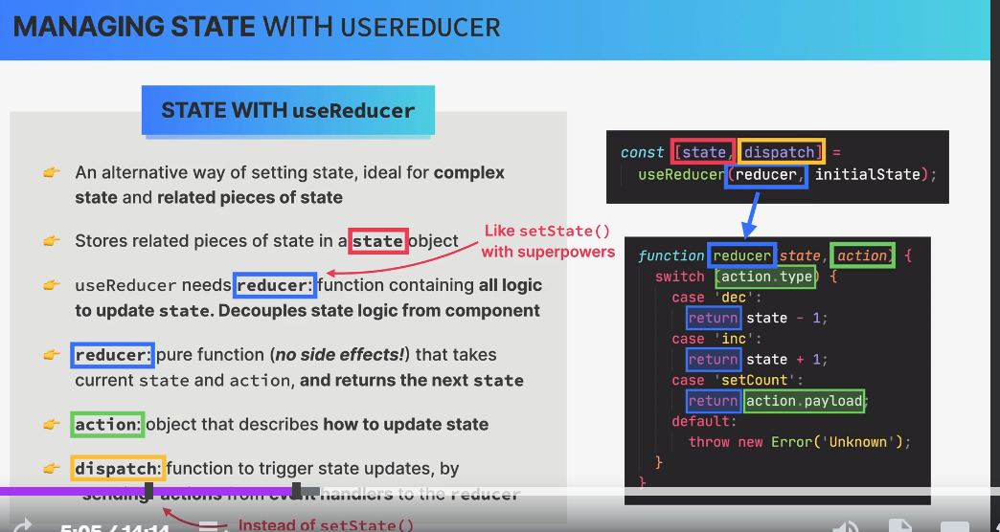
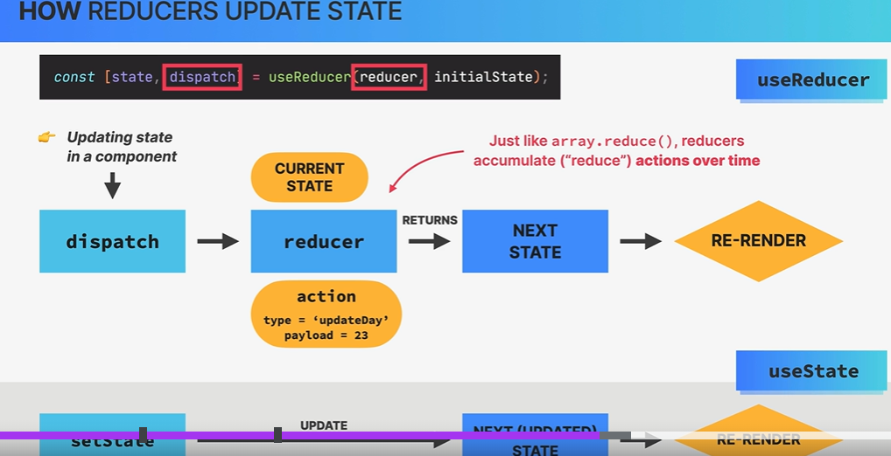

BY jonasschmedtmann- https://github.com/jonasschmedtmann/ultimate-react-course
# usereduse
- state object -  we can store related of state
- reduserFun - All logic to update state behav live setState
- reduser is a pure functio no side effect that take current state  and action and return a next state.
- action : How update State.
- dispatch : function trigger state updates by sending action from event handling to the reduser.

> Project 01 usepopcons
- INTERMEDIATREACT@2 folder
> Featers
- star rating 
- re-usable components
> NPM 
> Challanges

